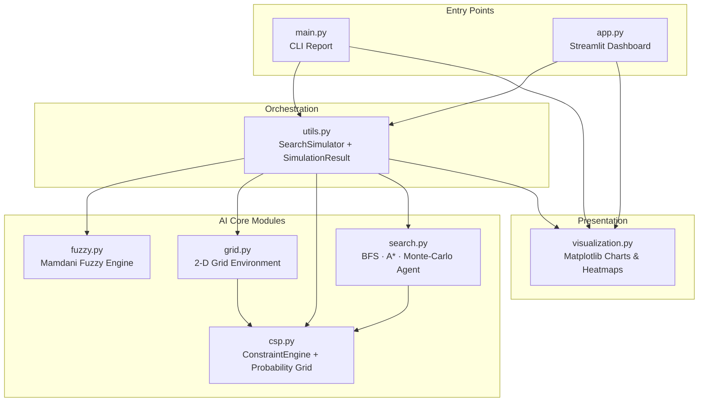
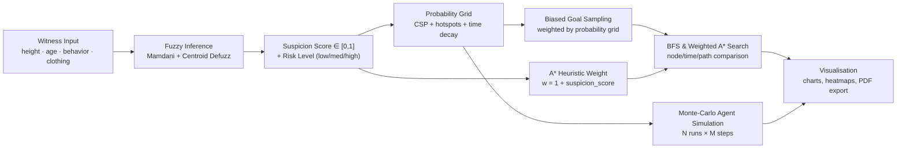

# jatAIyu — AI-Assisted Missing Person Search Simulation

**A modular AI pipeline that turns vague witness descriptions into ranked, explainable search-area recommendations, using fuzzy logic, constraint satisfaction, heuristic pathfinding, and Monte Carlo simulation — all running on synthetic data.**


> **A note on ethics:** This is an academic simulation built entirely on synthetic data. It's a decision-support research prototype, not a validated or deployable law-enforcement tool — the project documentation is explicit about that, and this README carries the same caveat forward.

---

## Table of Contents

- [Overview](#overview)
- [Problem Statement](#problem-statement)
- [Solution](#solution)
- [Features](#features)
- [Demo](#demo)
- [Screenshots](#screenshots)
- [Architecture](#architecture)
- [Project Workflow](#project-workflow)
- [Folder Structure](#folder-structure)
- [Tech Stack](#tech-stack)
- [Installation](#installation)
- [Requirements](#requirements)
- [Environment Variables](#environment-variables)
- [Usage](#usage)
- [Configuration](#configuration)
- [API Documentation](#api-documentation)
- [Machine Learning / AI Details](#machine-learning--ai-details)
- [Algorithms Used](#algorithms-used)
- [Project Flow](#project-flow)
- [Key Components](#key-components)
- [Code Structure](#code-structure)
- [Dependencies](#dependencies)
- [Testing](#testing)
- [Deployment](#deployment)
- [Troubleshooting](#troubleshooting)
- [Known Limitations](#known-limitations)
- [Future Improvements](#future-improvements)
- [Contributing](#contributing)
- [License](#license)
- [Acknowledgements](#acknowledgements)
- [Author](#author)

---

## Overview

**jatAIyu** (the working title used in the Streamlit UI) is a B.Tech mini-project — "AI-Assisted Missing Person Search Simulation System," built for the Principles of Artificial Intelligence Lab (DSE 3241) — that shows how a handful of classical AI techniques can be chained together into one explainable pipeline:

1. **Fuzzy logic** interprets vague witness language, things like "tall," "nervous," or "dark clothing."
2. **Constraint satisfaction (CSP)** turns that interpretation into a probability map over a 2-D grid.
3. **Search algorithms** — BFS and weighted A* — compute and compare paths to the most probable location.
4. **Monte Carlo simulation** models how the missing person might move over time and produces a visitation density heatmap.

The same core engine (`utils.SearchSimulator`) powers two different front ends:
- **`main.py`** — a terminal report with matplotlib pop-up charts.
- **`app.py`** — an interactive Streamlit dashboard with tabs, KPIs, and a PDF export button.

Everything runs on synthetic data. No real personal or case information is used or stored anywhere in the codebase.

## Problem Statement

*(Paraphrased from the project synopsis and report.)*

Missing-person investigations tend to be manual and reactive. Search areas are large and unstructured, witness descriptions are vague, and there's usually no computational way to prioritize which zones to search first, or to account for how a probable location shifts as time passes since the last sighting. Most traditional systems need exact, categorical inputs — they can't reason over something as graded and uncertain as "tall and nervous, wearing black."

## Solution

The project tackles each of those gaps with a specific AI technique:

| Gap | Technique | Module |
|---|---|---|
| Vague witness language | Mamdani fuzzy inference with centroid defuzzification | `fuzzy.py` |
| No spatial prioritisation | CSP-driven probability matrix (hard + soft constraints) | `csp.py` |
| No time-decay modelling | Exponential distance decay from last-seen cell, scaled by hours elapsed | `csp.py` |
| No algorithm benchmarking | Side-by-side BFS vs. suspicion-weighted A* comparison | `search.py` |
| No stochastic movement modelling | Monte Carlo agent simulation producing a density heatmap | `search.py` |
| No visual decision support | Matplotlib charts, heatmaps, and a Streamlit dashboard | `visualization.py`, `app.py` |

## Features

- **Mamdani fuzzy inference engine** — four input variables (height, age, behavior, clothing), three overlapping linguistic sets each, a 26-rule weighted rule base, max-aggregation, and centroid defuzzification.
- **Probability grid generation** — combines a uniform prior, hotspot-zone boosts, last-seen distance decay, a nervous-behavior edge bias, and a dark-clothing quadrant bias into one normalized heatmap.
- **CSP `ConstraintEngine`** — pluggable hard constraints (obstacle blocking) and weighted soft constraints (attractors), fully vectorized with NumPy.
- **BFS vs. weighted A*** — same grid, same start/goal, with timing and node-count comparison. The A* heuristic weight is derived dynamically from the fuzzy suspicion score (`w = 1 + suspicion_score`).
- **Monte Carlo `MissingPersonAgent`** — a probabilistic behavioral walk (configurable runs/steps) that produces a normalized visitation-density heatmap.
- **Multi-witness mode** (Streamlit only) — averages the fuzzy suspicion score across two to three independent witness statements.
- **One-click PDF export** (Streamlit only) — bundles every chart from a run into a single downloadable PDF via `matplotlib.backends.backend_pdf`.
- **Fully configurable environment** — grid size (5×5 up to 25×25 or 30×30, depending on entry point), obstacle density, 4- or 8-directional movement, random seed, last-seen location and elapsed time, and Monte Carlo run/step counts.
- **Input validation** — height, age, and grid-size bounds are enforced with explicit `ValueError`s (`csp.validate_*`).
- **Immutable results** — each run returns a frozen, hashable `SimulationResult` dataclass, so nothing gets mutated accidentally between UI re-renders.

## Demo

There's no live demo URL or video for this project at the moment.

If you deploy the app yourself — Streamlit Community Cloud, for example — you can drop the link in here:
`[Live Demo](https://your-deployment-url.streamlit.app)`

## Screenshots

No screenshot or image assets ship with the project (there's no `/assets`, `/images`, or `/screenshots` folder).

Placeholders below — swap these in with real captures of the Streamlit UI:

| Fuzzy Inference Tab | Probability Map Tab | BFS vs. A* Tab | Monte-Carlo Tab |
|---|---|---|---|
| `` | `` | `` | `` |

## Architecture

The application is a single-process, layered pipeline — no client-server split, no database, no external API. `main.py` and `app.py` are both thin front ends over the same `SearchSimulator` orchestrator.



## Project Workflow



Here's the same flow written out, step by step (this mirrors what actually happens in `main.py`):

1. Seed `random` and `numpy.random` for reproducibility.
2. Fuzzify height, age, behavior, and clothing, run all 26 rules, aggregate the results, and centroid-defuzzify to get a crisp suspicion score and risk level.
3. Build a `Grid` — obstacles are placed randomly, but `(0,0)` is always kept free as the start.
4. Build the probability matrix from the prior, hotspots, decay, and behavior/clothing bias.
5. Sample a biased goal cell from that probability matrix.
6. Build the `ConstraintEngine` — obstacle hard constraint plus edge/quadrant/uniform soft constraints. In the default configuration this is used for reporting only.
7. Run BFS and weighted A* from start to goal, recording nodes explored, path, and timing.
8. Optionally run N Monte Carlo simulations of a `MissingPersonAgent` to build a density heatmap.
9. Render all the charts: height/age membership, output aggregation, BFS-vs-A* grid, and the Monte Carlo heatmap.

## Folder Structure

```
AI_Project/
├── app.py                          # Streamlit web dashboard (v2.0)
├── main.py                         # CLI entry point / terminal report (v2.0)
├── utils.py                        # SearchSimulator orchestrator + SimulationResult
├── fuzzy.py                        # Mamdani fuzzy inference engine (rules, MFs, defuzz)
├── csp.py                          # ConstraintEngine, probability grid, validation helpers
├── grid.py                         # 2-D grid environment (obstacles, neighbours)
├── search.py                       # BFS, A*, MissingPersonAgent, Monte-Carlo runner
├── visualization.py                # All matplotlib chart/heatmap builders
├── AI Lab Project Synopsis.docx    # Original academic project synopsis
├── AI_PROJECT_REPORT.pdf           # Full academic project report (9 pages)
└── README.md                       # This file
```

`.git/` (version control metadata) and `__pycache__/` (compiled bytecode) exist in the archive too, but they're left out above since they're not part of the actual project structure.

## Tech Stack

| Category | Technology |
|---|---|
| Languages | Python 3.9+ |
| Frameworks | [Streamlit](https://streamlit.io) (interactive web UI) |
| Libraries | [NumPy](https://numpy.org) for vectorized numerical operations, [Matplotlib](https://matplotlib.org) for charts, heatmaps, and PDF export via `matplotlib.backends.backend_pdf` |
| Databases | None — the app is stateless per run; results live only in `st.session_state` for the current session |
| AI / ML | A custom, hand-coded Mamdani fuzzy inference system, a CSP constraint engine, BFS/weighted A* heuristic search, and Monte Carlo stochastic agent simulation. No trained ML models and no `scikit-learn`/`scikit-fuzzy`/deep-learning frameworks — everything here is classical, symbolic AI built from first principles. |
| Dev Tools | Git (the archive includes a local `.git` repository with a single commit, "Add initial files") |
| Deployment | None configured — no Dockerfile, CI/CD pipeline, or cloud config |

## Installation

The project doesn't ship a `requirements.txt`, `setup.py`, or `pyproject.toml`. The steps below were worked out from the `import` statements in the source and verified during this review (Python 3.12.3, NumPy 2.4.4, Matplotlib 3.10.8).

```bash
# 1. Clone the repository
git clone <your-repository-url>
cd AI_Project

# 2. (Recommended) create an isolated environment
python -m venv venv
source venv/bin/activate        # On Windows: venv\Scripts\activate

# 3. Install the dependencies
pip install numpy matplotlib streamlit
```

If you'd like a pinned, reproducible environment, save the following as `requirements.txt` (this isn't part of the original project — added here for convenience):
```
numpy
matplotlib
streamlit
```

## Requirements

| Requirement | Details |
|---|---|
| Python | 3.9 or higher. The bundled `__pycache__/*.cpython-39.pyc` files confirm 3.9 was used during development; this review also confirmed the code runs cleanly on Python 3.12. |
| OS | Platform-independent — pure Python plus NumPy, Matplotlib, and Streamlit |
| Display | A GUI backend is needed for `main.py`'s interactive `plt.show()` popups, but not for the Streamlit app, which renders charts inline |
| Internet access | Only needed by `app.py`, to load the "Inter" Google Font used in its custom CSS. The app otherwise runs fully offline. |

## Environment Variables

None. There are no `.env` files, no `st.secrets`, and no `os.environ`/`os.getenv` calls anywhere in the codebase. The app doesn't need any API keys, credentials, or external configuration to run.

## Usage

### Run the CLI version

```bash
python main.py
```

This prints a full step-by-step console report — fuzzy breakdown, CSP zones, grid, BFS/A* results, comparison table, Monte Carlo summary — and then opens five matplotlib figures (height MF, age MF, output MF, BFS-vs-A* comparison, Monte Carlo heatmap). Close the figure windows, or press Ctrl+C, to exit.

Sample output, captured while verifying this README with the default `CONFIG` in `main.py` (height=178, age=24, behavior="nervous", clothing="black", seed=42):

```
► Defuzzified Suspicion Score : 0.78
► Risk Level                  : HIGH
► A* heuristic weight         : 1.78
...
Nodes explored                    32          9
Path length                        9          9
A* explored 71.9% fewer nodes → A* more efficient.
```

Exact node counts and paths can vary slightly across NumPy versions, even with the same seed, since `np.random.choice` sampling behavior has changed between major NumPy releases. The underlying logic and the overall trend — A* exploring meaningfully fewer nodes than BFS — hold regardless.

### Run the Streamlit web dashboard

```bash
streamlit run app.py
```

This opens a browser tab with:
- A sidebar for the witness description (single or multi-witness), grid/environment settings, last-seen location, and Monte Carlo parameters.
- A KPI strip showing suspicion score, risk level, A* weight, hotspot zone count, and hours since last seen.
- Seven tabs: Fuzzy Inference, Age MF, Probability Map, BFS vs A*, Monte-Carlo, Performance, and Constraints.
- A "Run Simulation" button, plus a PDF export button that bundles all charts from the current run.

## Configuration

There's no external config file. Everything tunable lives in one of two places:
- Hard-coded constants at the top of `main.py` — the `CONFIG` dict, covering height, age, behavior, clothing, grid size, obstacle ratio, diagonals, seed, last-seen location, hours since seen, and Monte Carlo runs/steps.
- Interactive sidebar controls in `app.py` — sliders, checkboxes, and select boxes covering the same parameters, with bounds enforced in the UI.

The key tunable ranges, as enforced in code:

| Parameter | Valid range | Enforced in |
|---|---|---|
| Grid size (rows/cols) | 5–30 (`csp.validate_grid_size`); UI slider caps at 5–25 | `csp.py`, `app.py` |
| Height (cm) | 100–220 (`csp.validate_height`); UI slider is 140–195 | `csp.py`, `app.py` |
| Age (years) | 10–90 (`csp.validate_age`); UI slider is 15–70 | `csp.py`, `app.py` |
| Obstacle ratio | `[0.0, 1.0)` | `grid.py` |
| Behavior | `calm` \| `normal` \| `nervous` \| `very nervous` | `fuzzy.py` |
| Clothing | `black, brown, blue, gray, green, red, white, yellow` (unrecognised colours fall back to a neutral 0.33/0.33/0.33 prior) | `fuzzy.py` |

## API Documentation

Not applicable — this project doesn't expose a REST, GraphQL, or RPC API. It's a self-contained simulation delivered as a CLI script and a Streamlit app; every "call" is just a local Python function or class invocation within the same process. See [Key Components](#key-components) for the details.

## Machine Learning / AI Details

This project relies on classical, symbolic AI techniques rather than trained statistical or deep-learning models. There's no training data, no model file, and no inference server involved.

- **Models**: A hand-authored Mamdani fuzzy inference system (`fuzzy.py`) — four fuzzified inputs, a 26-rule weighted rule base, max-aggregation, and centroid defuzzification. There are no trained/ML model artifacts (`.pkl`, `.pt`, `.h5`, etc.) anywhere in the project.
- **"Training"**: None. The fuzzy rule base and membership-function parameters (like the height `short`/`medium`/`tall` breakpoints, or the age `young`/`adult`/`senior` breakpoints) are manually specified constants, not learned from data.
- **Dataset**: None. All inputs are synthetic — user-supplied scalars (height, age) and categorical labels (behavior, clothing) entered via CLI config or Streamlit widgets. No dataset file is bundled with the project.
- **Inference pipeline**:
  1. `fuzzify_height` and `fuzzify_age` (triangular/trapezoidal membership functions), plus `fuzzify_behavior` and `fuzzify_clothing` (direct output-term lookup tables), produce membership degrees.
  2. `_evaluate_rules` fires all 26 rules using a min T-norm (`min(μ_height, μ_age, μ_behavior, μ_clothing) × rule_weight`) and aggregates the clipped output membership functions by point-wise maximum.
  3. `_centroid_defuzz` computes the centroid of the aggregated set over 500 discrete points on `[0.0, 1.0]`, producing a crisp suspicion score.
  4. `get_risk_level` thresholds that score into low (< 0.35), medium (0.35–0.60), or high (≥ 0.60).
- **Evaluation**: The project report (`AI_PROJECT_REPORT.pdf`) documents a manual case study — height 178, age 24, nervous, black clothing → suspicion ≈ 0.62, risk HIGH — along with a BFS-vs-A* efficiency comparison where A* explored roughly 60% fewer nodes than BFS for equal-length paths in the report's example run. Formal accuracy/precision/recall metrics don't really apply here, since this isn't a classification or prediction model being validated against ground truth — it's a rule-based decision-support simulation.

## Algorithms Used

| Algorithm | Purpose | File |
|---|---|---|
| Mamdani fuzzy inference (trimf/trapmf fuzzification, min T-norm, max aggregation, centroid defuzzification) | Convert linguistic witness input into a crisp suspicion score | `fuzzy.py` |
| Constraint satisfaction (hard + weighted soft constraints) | Compute a per-cell feasibility/attractiveness score matrix | `csp.py` |
| Breadth-first search (BFS) | Uninformed, complete, shortest-path (fewest edges) baseline search | `search.py` |
| Weighted A* (`f(n) = g(n) + w·h(n)`, Manhattan or Euclidean heuristic depending on movement mode) | Informed, suspicion-weighted search toward the biased goal | `search.py` |
| Monte Carlo simulation (repeated probabilistic random walks) | Model stochastic movement and build a visitation density heatmap | `search.py` |
| Weighted random sampling (`np.random.choice` over normalised weights) | Biased goal selection and agent step selection from the probability grid | `csp.py`, `search.py` |

## Project Flow

1. **Input** — witness statement(s) captured via `CONFIG` (CLI) or sidebar widgets (Streamlit); optional last-seen cell and hours elapsed; environment parameters like grid size, obstacle density, movement mode, and RNG seed.
2. **Validate** — `csp.validate_grid_size`, `validate_height`, and `validate_age` raise a `ValueError` on out-of-range input, and `app.py` re-checks these with user-facing `st.error` messages.
3. **Infer** — `utils.SearchSimulator.run()` calls `fuzzy.get_score_breakdown()` to get the suspicion score, risk level, and every intermediate membership value.
4. **Map** — `csp.generate_probability_grid()` builds the spatial probability matrix, and `csp.generate_biased_goal()` samples the target cell.
5. **Search** — `search.run_both()` runs BFS and weighted A* on the same grid, start, and goal, returning a unified timing/nodes/path comparison.
6. **Simulate** *(optional)* — `search.run_monte_carlo()` runs N `MissingPersonAgent` walks and returns a normalized density matrix.
7. **Package** — every output gets assembled into an immutable `utils.SimulationResult` dataclass.
8. **Present** — `visualization.py` renders the membership charts, the aggregated fuzzy output, the BFS/A* comparison grid with probability and hotspot overlays, and the Monte Carlo heatmap. `app.py` additionally offers a bundled PDF export.

## Key Components

| Component | Type | Responsibility |
|---|---|---|
| `SearchSimulator` | Class (`utils.py`) | The single orchestrator — owns the entire pipeline from raw inputs to `SimulationResult` |
| `SimulationResult` | Frozen dataclass (`utils.py`) | Immutable container for every output of one run (fuzzy breakdown, grid, paths, densities, timings) |
| `ConstraintEngine` | Class (`csp.py`) | Registers and combines named hard (`HardConstraint`) and soft (`SoftConstraint`) constraints into a feasibility score matrix |
| `Grid` | Class (`grid.py`) | 2-D obstacle map with neighbour queries (4- or 8-connected), free-cell caching, and biased/uniform random sampling |
| `MissingPersonAgent` | Class (`search.py`) | A probabilistic, behavior-biased random walker used by the Monte Carlo simulation |
| `average_witness_score()` | Function (`utils.py`) | Averages fuzzy suspicion scores across multiple independent witness reports in multi-witness mode |
| `_build_pdf()` | Function (`app.py`) | Bundles every chart from a Streamlit run into one downloadable PDF via `matplotlib.backends.backend_pdf.PdfPages` |

## Code Structure

| File | Lines | Purpose |
|---|---:|---|
| `app.py` | 1,213 | Streamlit UI: custom CSS theme, animated hero header, sidebar controls, 7-tab results dashboard, PDF export |
| `csp.py` | 405 | Input validation, `ConstraintEngine`, hotspot-zone definitions, probability-grid and biased-goal generation |
| `fuzzy.py` | 416 | MF primitives (`trimf`/`trapmf`), fuzzification functions, 26-rule base, rule evaluation, centroid defuzzification |
| `grid.py` | 196 | `Grid` class: obstacle placement, neighbour queries, free-cell caching, display |
| `main.py` | 266 | CLI entry point: seeds RNG, runs the pipeline, prints a structured console report, opens matplotlib figures |
| `search.py` | 388 | `manhattan`/`euclidean` heuristics, `bfs`, `astar`, `run_both`, `MissingPersonAgent`, `run_monte_carlo` |
| `utils.py` | 343 | `SimulationResult` dataclass, `average_witness_score`, `SearchSimulator` orchestrator |
| `visualization.py` | 517 | All matplotlib figure builders plus `save_all_figures()` batch export helper |
| **Total** | **3,744** | |

## Dependencies

Inferred from the `import` statements, since there's no dependency manifest in the project:

| Package | Used for |
|---|---|
| `numpy` | Vectorized probability-grid math, membership-function arrays, weighted random sampling, density matrices |
| `matplotlib` | All charts, grid heatmaps, the Monte Carlo heatmap, and PDF export via `matplotlib.backends.backend_pdf` |
| `streamlit` | The web dashboard (`app.py` only — not needed to run `main.py`) |

Standard-library modules used: `sys`, `io`, `random`, `math`, `time`, `heapq`, `textwrap`, `dataclasses`, `typing`, `collections.deque`, `__future__`. There's no third-party fuzzy-logic library like `scikit-fuzzy` involved — the Mamdani engine is built entirely from scratch.

## Testing

There's no automated test suite in the project — no `tests/` directory, no `pytest`/`unittest` files, and no CI configuration. For this README, functional correctness was spot-checked by:
- Compiling all eight modules with `python -m py_compile` (all passed).
- Running `python main.py` end-to-end headlessly (`MPLBACKEND=Agg`), which completed all seven pipeline steps and produced a valid console report and figures.

If you extend this project, adding a `tests/` directory — `pytest` unit tests for `fuzzy.calculate_suspicion`, `csp.generate_probability_grid`, and `search.bfs`/`astar` against known small grids would be a good place to start — is a natural next step. See [Future Improvements](#future-improvements).

## Deployment

There's no deployment configuration in the project — no Dockerfile, `Procfile`, CI/CD workflow, or cloud manifest. Right now the app only runs as a local script or Streamlit process.

If you want to deploy the Streamlit app yourself (this isn't part of the original project, just general guidance):
- **Streamlit Community Cloud**: push the repo to GitHub, add a `requirements.txt` (see [Installation](#installation)), and point Streamlit Community Cloud at `app.py`.
- **Containerized deployment**: write a `Dockerfile` that installs `numpy`, `matplotlib`, and `streamlit`, copies the source, and runs `streamlit run app.py --server.port=$PORT --server.address=0.0.0.0`.

## Troubleshooting

| Symptom | Likely cause | Fix |
|---|---|---|
| `ModuleNotFoundError: No module named 'streamlit'` (or `numpy`/`matplotlib`) | Dependencies not installed | `pip install numpy matplotlib streamlit` |
| `main.py` hangs, or no windows appear | No GUI backend available (e.g. headless server/SSH session) | Run with `MPLBACKEND=Agg python main.py` and use `visualization.save_all_figures()` to export PNGs/PDF instead of `plt.show()`, or use the Streamlit app instead |
| `ValueError: Height must be between 100 and 220 cm...` | Input outside the validated range | Adjust the value in `CONFIG` (`main.py`) or the sidebar slider (`app.py`) |
| `ValueError: Grid size must be between 5×5 and 30×30...` | `grid_rows`/`grid_cols` out of range | Use a grid size between 5 and 30 (`main.py` `CONFIG`); the Streamlit slider is pre-capped at 5–25 |
| Streamlit page looks unstyled, Inter font missing | No internet access to load the Google Fonts `@import` in the custom CSS | Non-blocking — the app falls back to the browser's default sans-serif font |
| Different node counts or paths than the report for the same seed | NumPy's RNG implementation can shift slightly across major versions | Expected — the qualitative result (A* exploring fewer nodes than BFS) still holds; pin your NumPy version for exact reproducibility |

## Known Limitations

*(Drawn from the code and from the project report's "Future Scope" and "Observations" sections.)*

- **No real geographic data** — the environment is an abstract N×N grid, not a real map. There's no road network or OpenStreetMap/GIS integration.
- **Fixed, non-adaptive agent** — `MissingPersonAgent` follows an analytically-derived probabilistic walk rather than a learned policy; there's no reinforcement learning here.
- **Static probability updates** — the probability grid is computed once per run and doesn't do live Bayesian updates as new witness reports come in.
- **Single-agent only** — no multi-agent or coordinated search-team modelling.
- **Manual categorical witness input only** — there's no natural-language interface; witnesses have to be described via fixed dropdowns and sliders (height, age, one of four behaviors, one of eight clothing colors).
- **No automated tests or CI** — correctness relies on manual, report-level validation rather than a regression test suite.
- **No persistence layer** — nothing is saved between runs beyond the current Streamlit session state; there's no database or file-based history.
- **Hotspot zone coordinates are hard-coded** for a nominal 10×10 layout, and are only clipped (not re-derived) for other grid sizes.

## Future Improvements

*(Taken directly from the project report's "Future Scope" section, Section 7.)*

- **Reinforcement-learning policy** — replace the fixed probabilistic walk with a trained Q-learning or policy-gradient agent for more realistic movement, like goal-directed evasion.
- **Dynamic Bayesian fusion** — update the posterior probability map in real time as new witness reports arrive.
- **Real GIS integration** — replace the synthetic grid with real map data, using OpenStreetMap tiles or road networks via `NetworkX`/`OSMnx`.
- **Multi-agent search** — coordinate multiple search agents with non-overlapping zone assignments.
- **Natural-language witness interface** — parse free-form statements (via NLP/LLM) into structured attributes instead of manual dropdowns.
- **Explainability dashboard** — a real-time display of rule-by-rule firing strengths and constraint scores, to build operator trust.

## Contributing

There's no `CONTRIBUTING.md` in the project, but if you'd like to contribute:

1. Fork the repository.
2. Create a feature branch: `git checkout -b feature/your-feature`.
3. Make your changes — consider adding tests (see [Testing](#testing)).
4. Commit with a clear message and open a pull request describing the change and why you made it.

## License

There's no `LICENSE` file in the project, so it doesn't currently specify usage terms. If you're the author, consider adding an open-source license (MIT or Apache-2.0, for instance) to clarify how others can use, modify, or distribute this code.

## Acknowledgements

- **Russell, S. J., & Norvig, P.** (2020). *Artificial Intelligence: A Modern Approach* (4th ed.). Pearson — foundation for the BFS/A*/CSP design.
- **Zadeh, L. A.** (1965). *Fuzzy Sets*. Information and Control, 8(3), 338–353 — foundation for the fuzzy inference engine.
- **Mamdani, E. H., & Assilian, S.** (1975). *An experiment in linguistic synthesis with a fuzzy logic controller*. Int. J. Man-Machine Studies — the Mamdani inference architecture used in `fuzzy.py`.
- **Sutton, R. S., & Barto, A. G.** (2018). *Reinforcement Learning: An Introduction* (2nd ed.). MIT Press — conceptual inspiration for the agent model and the future RL extension.
- **Hart, P. E., Nilsson, N. J., & Raphael, B.** (1968). *A formal basis for the heuristic determination of minimum cost paths*. IEEE TSSC — the original A* algorithm.
- **Stone, L. D.** (1975). *Theory of Optimal Search*. Academic Press — the probability-of-detection map concept behind the probability grid.
- **Queralta, J. P., et al.** (2020). *Collaborative multi-robot search and rescue*. Sensors, 20(9), 2643 — motivation for the suspicion-weighted A* heuristic.
- Built with the open-source NumPy, Matplotlib, and Streamlit projects.

*(The full reference list is available in `AI_PROJECT_REPORT.pdf`, Section 8.)*

## Author

**Samarth Agrawal**
B.Tech, Data Sciences and Engineering — Principles of Artificial Intelligence Lab (DSE 3241)
Mini Project Report, April 2026 · Team: Individual

Contact and social links — placeholder, not yet added:
`[GitHub](#) · [LinkedIn](#) · [Email](#)`

---

<p align="center"><sub>Generated from a full source-code, documentation, and report analysis of the uploaded project archive. Sections marked as not found in the project reflect the absence of that artifact in the codebase at the time of analysis.</sub></p>